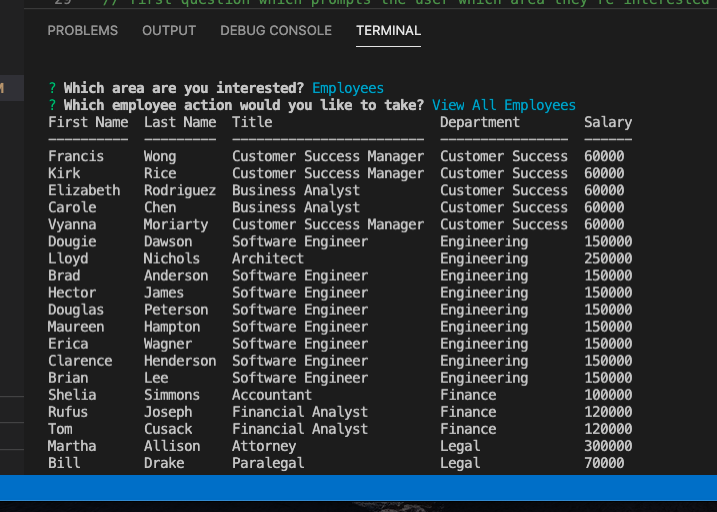

# Employee Tracker App
    
## Table of Contents

  - [Description](#description)
  - [Installation](#installation)
  - [Usage](#usage)
  - [License](#license)
  - [Contributing](#tests)
  - [Questions](#questions)
    
## Description
    
For admins or owners that need to keep track of a lot of employee information. 

    
## Installation
    
- Clone github repo at [pmo48/employee-tracker](https://github.com/pmo48/employee-tracker)
- Clone to appropriate directory
- Install npm dependecies
- Run "schema.sql" in MySql to install DB and initialize a few EE names (note: you will need to add managers to employees either using the app or via MySql)
- Type "node server" to launch the application"
    
## Usage
    
- Giving 100% on homework
- CRUD related to department, role and employee entities
- Viewing budgetary information joining various tables
    
## License

[mit](https://choosealicense.com/licenses/mit/)
    
## Contributing
    
If you would like to contribute it, please utilize The [Contributor Covenant](https://www.contributor-covenant.org/) as a guideline.
    
## Questions
    
### What's your GitHub info?
    
My GitHub username is pmo48 and my profile can be found at github.com/pmo48
    
### What other contact info do you have?
    
I can be contacted via email at pmoriarty100@gmail.com if you have any additional questions.